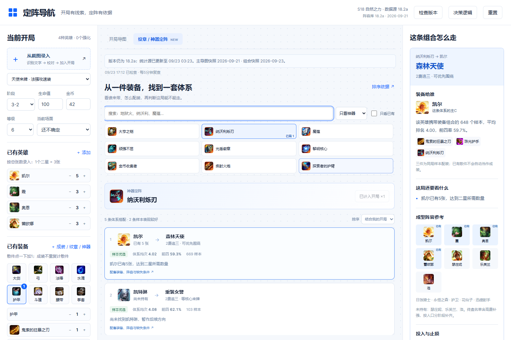

# 金铲铲定阵导航

输入已有英雄、装备、海克斯和前期经济，用可解释的决策导图比较阵容方向；也可以从一件纹章或神器反查适配英雄与体系。



## 功能

- **开局决策导图**：综合装备、来牌、强化、经济和同行，显示推荐依据、缺失条件与下一步。
- **纹章 / 神器定阵**：45件装备、137条携带者与体系搭配，关联19个体系；支持按样本表现或已有开局排序。
- **两种输入**：点选英雄、装备、强化，或在本机识别截图文字，再手动校对归属与数量。
- **版本检查**：启动时和页面可见时每5分钟检查数据源版本，也可手动检查。检测到新版本会提示旧数据。
- **本地运行**：无账号、无 API Key、无需安装 npm 运行依赖。截图不上传服务器。

## 直接使用

在 [Releases](https://github.com/jonathanbigbro/jcc-decision-map/releases) 下载 `jcc-decision-map-v1.0.0.zip`，解压后运行：

```bash
python server.py --port 8765
```

打开 <http://127.0.0.1:8765/>。Windows 也可双击 `启动定阵导航.cmd`。需要 Python 3.10 或更高版本；macOS / Linux 可使用 `python3`。

详细操作见 [使用说明](USER_GUIDE.md)。不要直接运行 `src/index.html`，它是构建模板。

## 从源码运行

```bash
git clone https://github.com/jonathanbigbro/jcc-decision-map.git
cd jcc-decision-map
python scripts/build.py
python dist/server.py --port 8765
```

构建只使用 Python 标准库，会将代码、图鉴图片和本地 OCR 依赖打包到 `dist/`。

生成可分发 ZIP：

```bash
python scripts/build.py --zip releases/jcc-decision-map-v1.0.0.zip
```

## 数据范围

| 内容 | 当前收录 |
| --- | --- |
| 赛季 / 补丁 | S18 自然之力 / 18.2a |
| 主导图库 | 2026-09-21 快照，12条路线 |
| 组合库 | 2026-09-23 快照，21种纹章、24件神器、137条组合、19个体系 |
| 图鉴 | 65个去重英雄名称、137件装备、228个强化 |

数据来自 [金铲铲大数据](https://www.dataj.cc/)。每件特殊装备最多收录数据源提供的5条常见体系。**自动版本检查不会自动替换阵容库或组合库**；补丁变化后需重新核对数据和规则。

匹配分是可解释的启发式分数，不是胜率；展示的前四率来自已成型样本，也不是当前开局的获胜概率。规则尚未通过实战回测。小样本、低血贪九五、缺少第二枚纹章等情况会单独提示。

截图识别只读取可见文字，不可靠判断无文字头像、星级、商店归属或未选强化。识别结果需要用户确认后才计入开局。

## 项目结构

```text
src/                 页面模板、规则引擎、数据快照与本地服务器
public/assets/       图鉴图片
public/vendor/       本地 OCR 运行库、语言文件及许可证
scripts/build.py     跨平台构建与打包
tests/               决策规则、特殊装备组合与版本缓存测试
docs/preview.png     界面预览
```

## 验证

规则测试需要 Node.js 18+；版本服务测试使用 Python 标准库：

```bash
node tests/engine.test.mjs
node tests/synergy.test.mjs
python tests/version_test.py
```

本地服务器仅监听 `127.0.0.1`。本项目以源码和本地运行包发布；GitHub Pages 等纯静态托管无法直接运行 Python 版本检查接口。

## 素材与依赖

本项目与腾讯、Riot Games 无官方关联。游戏名称、图标、数据和第三方组件的权利归各自权利人；公开仓库不意味着这些素材可以任意再授权。来源和第三方许可证见 [THIRD_PARTY_NOTICES.md](THIRD_PARTY_NOTICES.md)。
